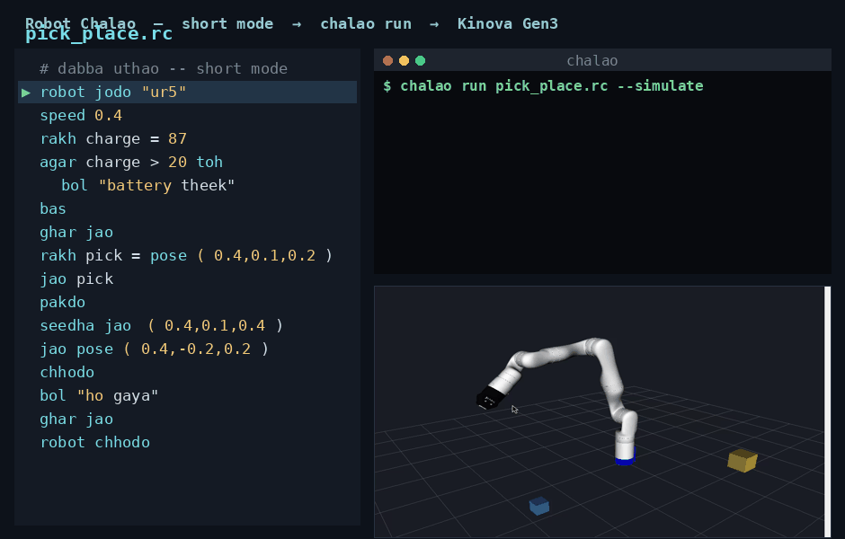
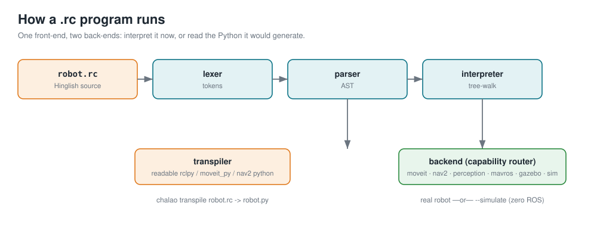
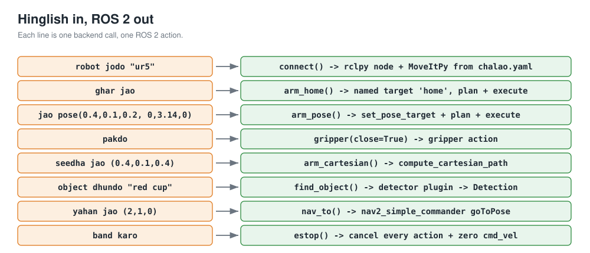
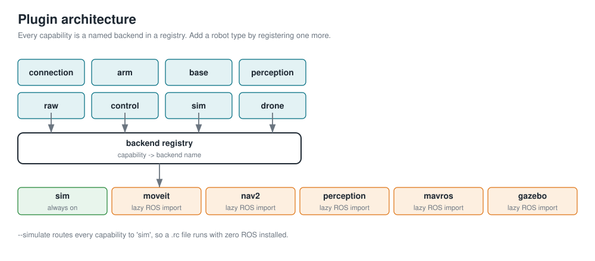

# Robot Chalao 🤖



*Robot Chalao `.rc` code in short mode (`rakh`, `bol`, `bas`), the `chalao run --simulate` output, and the Kinova Gen3 executing it in RViz.*

**Hinglish mein likho, koi bhi ROS 2 robot chalao.**
**Write Hinglish, run any ROS 2 robot.**

Robot Chalao ek chhoti programming language hai (file `.rc`) jisse aap Hindi-English
mix mein likh kar ek asli ya simulated robot chala sakte ho — arm, mobile base, drone,
humanoid, gripper, sensor. ROS nahi aati? Koi baat nahi. `--simulate` mode bina ROS ke
chalta hai, aur har line jo ROS 2 call banegi wo Hinglish mein print karta hai.

Robot Chalao is a small programming language (`.rc` files) that lets someone who knows
Hinglish but not ROS write a short script and drive a real or simulated robot — arms,
mobile bases, drones, humanoids, grippers, sensors. Advanced users can still drop down
to raw ROS 2 calls. `--simulate` runs with zero ROS installed and prints, in Hinglish,
exactly the ROS 2 calls it would make.

```
# pehla program / your first program
robot jodo "ur5"          # connect to the arm from chalao.yaml
speed 0.4
ghar jao                  # go home
maano pick = pose(0.4, 0.1, 0.2, 0, 3.14, 0)
jao pick                  # move to the pick pose
pakdo                     # close the gripper
seedha jao (0.4, 0.1, 0.4)   # lift straight up
chhodo                    # open the gripper
ghar jao
robot chhodo
```

```bash
chalao run pehla.rc --simulate --config examples/chalao.yaml
```



*Ek front-end, do back-end: abhi chalao, ya jo Python banega use padho. One front-end,
two back-ends: interpret it now, or read the generated Python.*

## Native core (C++)

Robot Chalao now ships a **native C++17 interpreter** in [`native/`](native/) alongside the Python reference — the language's compiled foundation. Build it with `make -C native` to get a standalone `chalao` binary (no Python, no dependencies) that runs the same `.rc` programs, byte-for-byte identical to the reference:

```bash
make -C native
./native/chalao run examples/01_arm_pick_place.rc
```

## Kise ke liye? / Who is this for

Bharat mein bahut log Hinglish mein sochte hain par ROS 2 ka learning curve unko rok
deta hai. Robot Chalao wo doori kam karta hai: seedhe, natural commands, aur asli ROS
2 / MoveIt 2 / Nav2 / Gazebo neeche. For people who think in Hinglish but are blocked by
the ROS 2 learning curve. Plain commands on top, real ROS 2 underneath.

## Install

```bash
# sirf language + simulator (zero ROS)
pip install git+https://github.com/megazron/robot-chalao

# asli robot ke liye / for real robots, also install and source ROS 2:
#   ROS 2 Jazzy ya Humble, MoveIt 2, Nav2, Gazebo, MAVROS (jitna chahiye)
#   sudo apt install ros-jazzy-desktop ros-jazzy-moveit ros-jazzy-navigation2 \
#        ros-jazzy-nav2-bringup ros-jazzy-ros-gz
#   source /opt/ros/jazzy/setup.bash
#   source ~/your_ws/install/setup.bash
```

`--simulate` ko ROS ki zaroorat nahi. `chalao doctor` batata hai kya installed hai.
`--simulate` needs none of that; `chalao doctor` tells you what is installed and how
to fix what is missing, in Hinglish.

## CLI

| Command | Kaam / What it does |
|---|---|
| `chalao run file.rc` | program chalao (real robot) |
| `chalao run file.rc --simulate` | bina ROS ke dry-run |
| `chalao transpile file.rc -o out.py` | padhne-layak Python (rclpy/moveit_py/nav2) banao |
| `chalao repl` | interactive shell (`madad` = help) |
| `chalao doctor` | ROS/MoveIt/Nav2 check, Hinglish diagnostics |
| `--config chalao.yaml` | robot config file chuno |

## Hinglish in, ROS 2 out



*Har Hinglish line ek backend call hai, ek ROS 2 action. Each Hinglish line is one
backend call, one ROS 2 action.*

The complete keyword and command tables live in [`docs/GRAMMAR.md`](docs/GRAMMAR.md).
A summary:

**Core language**

| Hinglish | English |
|---|---|
| `maano x = 5` | variable |
| `agar … toh … warna … khatam` | if / else |
| `jab tak … karo … khatam` | while |
| `har x list mein karo … khatam` | for-each |
| `kaam f(a,b) … wapas … khatam` | function / return |
| `dikhao …` | print |
| `sach / jhooth / aur / ya / nahi` | true / false / and / or / not |
| `koshish … galti hone par e … khatam` | try / except |
| `ruko_loop` / `import "x.rc"` | break / import |

## Short forms

Don't want to type the long keywords? Use the short aliases. These are
**aliases**, not a new language: they map to the exact same keywords, so old
programs keep working and you can mix both in one file. Example 06 uses them and
prints byte-for-byte the same output as example 01.

| Short | Full | does |
|---|---|---|
| `bas` | `khatam` | end a block |
| `bol` | `dikhao` | print |
| `rakh` | `maano` | variable (`rakh x = 5`) |
| `try` | `koshish` | try |
| `de` | `wapas` | return |
| `tod` | `ruko_loop` | break a loop |

```
robot jodo "ur5"
speed 0.4
ghar jao
rakh pick = pose(0.4, 0.1, 0.2, 0, 3.14, 0)   # rakh = maano
jao pick
pakdo
agar battery kitni hai > 20 toh
    bol "battery theek hai"                    # bol = dikhao
warna
    bol "charge chahiye"
bas                                            # bas = khatam
robot chhodo
```

**Robot commands** (full mapping in `docs/GRAMMAR.md`): connection (`robot jodo`,
`robot chhodo`, `namespace`, `param`), arm via MoveIt 2 (`ghar jao`, `jao pose(...)`,
`seedha jao`, `pakdo`/`chhodo`, `speed`, `planner`, `rukawat jodo`, `attach`, `kahan hai`,
`IK nikalo`), mobile via Nav2 (`aage chalo`, `ghumo`, `yahan jao`, `waypoints follow`,
`map banao`/`save`, `obstacle nazdeek hai?`), perception (`camera dekho`, `object dhundo`,
`lidar padho`, `battery kitni hai`, `AprilTag dhundo`, `TF pucho`), raw ROS 2 (`sun`,
`bolo`, `sewa bulao`, `action bhejo`, `record shuru`, `launch`, `urdf load`), ros2_control
(`joint "j1" ko 1.2 rad pe le jao`, `controller switch`, `torque on/off`), simulation
(`simulation shuru gazebo`, `spawn`, `rviz kholo`), safety and timing (`band karo`,
`workspace limit`, `ruko 2 second`, `har 0.1 second mein … khatam`, `deadline`), and
drone via MAVROS (`udaan bharo`, `utro`, `height`).

## Config — `chalao.yaml`

`robot jodo "naam"` config file se robot uthata hai: type, planning group, ee link,
gripper topic, cmd_vel, named poses, speed/workspace limits, camera topics.

```yaml
default_robot: ur5
robots:
  ur5:
    type: arm
    planning_group: manipulator
    ee_link: tool0
    base_link: base_link
    gripper: {action: "/gripper_controller/gripper_cmd"}
    named_poses: {home: [0, -1.57, 0, -1.57, 0, 0]}
    speed_limit: 0.5
    workspace: {xmin: -0.8, xmax: 0.8, ymin: -0.8, ymax: 0.8, zmin: 0.0, zmax: 1.2}
    cameras: {main: "/camera/image_raw"}
    backends: {arm: moveit, perception: perception, raw: raw}
  turtlebot:
    type: mobile
    cmd_vel: /cmd_vel
    backends: {base: nav2, perception: perception, raw: raw}
```

## Examples

Sab `--simulate` mein chalte hain. All run in `--simulate`:

```bash
chalao run examples/01_arm_pick_place.rc --simulate --config examples/chalao.yaml
chalao run examples/02_mobile_patrol.rc  --simulate --config examples/chalao.yaml
chalao run examples/03_camera_pick.rc    --simulate --config examples/chalao.yaml
chalao run examples/04_slam_map.rc       --simulate --config examples/chalao.yaml
chalao run examples/05_drone_square.rc   --simulate --config examples/chalao.yaml
```

1. **Arm pick and place** — go home, pick, straight-line lift, place.
2. **Mobile patrol** — patrol four waypoints, checking for obstacles.
3. **Camera pick** — find a red cup, then the arm grabs and places it.
4. **SLAM map building** — start SLAM, drive a loop, save the map.
5. **Drone square** — take off, fly a 2 m square, land.

Details in [`examples/README.md`](examples/README.md).

## Read the generated Python

Kabhi kabhi aap dekhna chahoge ki neeche kya ho raha hai. `chalao transpile` aapke
`.rc` ko padhne-layak `rclpy` + `moveit_py` + `nav2_simple_commander` Python mein badal
deta hai — seekhne aur debug karne ke liye.

```bash
chalao transpile examples/01_arm_pick_place.rc -o arm.py
```

## Plugin architecture



*Har capability ek named backend hai. Naya robot type? Ek aur backend register karo.
Each capability is a named backend; add a robot type by registering one more.*

Backends: `sim` (hamesha on), `moveit`, `nav2`, `perception`, `raw`, `control`,
`gazebo`, `mavros`. Real backends ROS ko lazily import karte hain, to package bina ROS
ke bhi import hota hai; method call par hi Hinglish error aata hai agar ROS nahi mila.

## Grammar (EBNF, chhota sa hissa)

```ebnf
statement  = let_stmt | if_stmt | while_stmt | for_stmt | func_def
           | try_stmt | print_stmt | robot_cmd | ... ;
if_stmt    = "agar" expr "toh" NEWLINE block [ "warna" NEWLINE block ] "khatam" ;
for_stmt   = "har" IDENT expr "mein" "karo" NEWLINE block "khatam" ;
robot_cmd  = [ "robot" STRING ] verb_phrase ;
```

Poora grammar / full grammar: [`docs/GRAMMAR.md`](docs/GRAMMAR.md).

## Errors sab Hinglish mein

```
Bhai, line 12: 'khatam' bhool gaye (block not closed)
Bhai, line 8: 'cup' naam ka kuch nahi hai (undefined variable)
ROS 2 nahi mila (source your ROS 2 setup or use --simulate)
```

## Troubleshooting

```bash
chalao doctor
```
Yeh check karta hai rclpy, moveit_py, nav2_simple_commander, tf2, OpenCV — aur har ek
ke liye ek line ka fix deta hai. Checks each dependency and prints a one-line fix.

## VS Code

`vscode-extension/` mein syntax highlighting + snippets hain. See
[`vscode-extension/README.md`](vscode-extension/README.md).

## Roadmap

Multi-robot fleets, Hinglish behaviour trees, LLM/voice commands, aur ek web IDE —
[`docs/ROADMAP.md`](docs/ROADMAP.md). Honest status har item ke saath.

## Contributing

Naya backend, naya keyword, ya naya example — swagat hai. `PYTHONPATH=src python3 -m
pytest -q` pass hona chahiye. New backends, keywords and examples welcome; keep the
test suite green.

## License

MIT. Banaya / built by Gaus Mohiuddin Sayyad ([megazron](https://github.com/megazron)).
